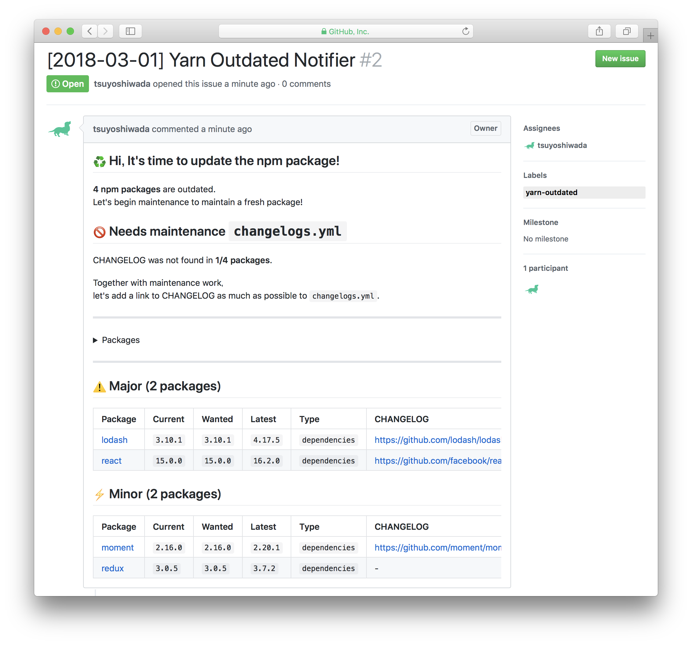

# :rocket: yarn-outdated-notifier

[](https://www.npmjs.com/package/yarn-outdated-notifier)
[](https://circleci.com/gh/cats-oss/yarn-outdated-notifier)

> Add link to CHANGELOG the result of `$ yarn outdated`, and notify to GitHub Issue.


## Example Issue



> **Issue URL:** https://github.com/tsuyoshiwada/yarn-outdated-notifier-with-circleci/issues/2


## Motivation


`yarn-outdated-notifier` will help you update the npm package on which you depend.


### 1. Keeping fresh package

`yarn` has a useful toolset for updating npm packages like `yarn outdated` and `yarn upgrade-interactive`.  
Utilize these tool sets to visualize packages that need updating and register them to GitHub Issue.


### 2. Understand the changes

The problem with updating the npm package is that unintended changes destroy the project.  
By checking CHANGELOG prepared by each package, it is possible to solve this problem to a certain extent.

Therefore, `yarn-outdated-notifier` adds a link to CHANGELOG to the result of `yarn outdated` and notifies.


---


Since CircleCI and TravisCI have the function of cron, you can use it to make periodic package update notifications :tada:


## Installation

```bash
$ yarn add -D yarn-outdated-notifier
```


## Usage

Please access the page of [Personal access tokens](https://github.com/settings/tokens) and issue a token. You need the scope of `repo`.

By passing the issued token to the `--api-token` option and executing the command, we will inform GitHub's Issue of the result of `$ yarn outdated`.

```bash
$ yarn outdated-notifier --help

  Add link to CHANGELOG the result of `$ yarn outdated`, and notify to GitHub Issue.

  USAGE:
    $ outdated-notifier [options]

  OPTIONS:
    --api-token         API token for GitHub (required)
    --githubApiAddress, provide address for github enterprise (default: api.github.com)
    --owner,      -o    repository owner name (default: "git config --get remote.origin.url" infomation)
    --repository, -r    repository name (default: "git config --get remote.origin.url" infomation)
    --title,      -t    issue title for GitHub
    --labels,     -l    issue labels name for GitHub
    --assignees,  -a    issue assignees name for GitHub
    --excludes,   -e    path to yaml file which specify package names to exclude
    --changelogs, -c    path to yaml file which specify changelog uris for the packages
    --template          path to the template to use for notification
    --dry-run           do not register on issue, output contents to stdout
    --help,       -h    show help
    --version,    -v    print the version

  EXAMPLES:
    $ yarn outdated-notifier --api-token <your_personal_token>
    $ yarn outdated-notifier --api-token <your_personal_token> --labels "label_name" --assignees "assignee_name"
    $ yarn outdated-notifier --api-token <your_personal_token> --template "./template.hbs"
    $ yarn outdated-notifier --api-token <your_personal_token> --changelogs "./changelogs.yml"
    $ yarn outdated-notifier --api-token <your_personal_token> --changelogs "./changelogs.yml" --excludes "./excludes.yml"
```


### Prepare the CHANGELOG link

Please create a YAML file with the package name and the link to CHANGELOG in the format shown below and specify it in the `--changelogs` option. (e.g. `changelogs.yml`)

```yaml
react: https://github.com/facebook/react/blob/master/CHANGELOG.md
lodash: https://github.com/lodash/lodash/wiki/Changelog
moment: https://github.com/moment/moment/blob/develop/CHANGELOG.md
...
```


## Thanks

* [yarnpkg/yarn](https://github.com/yarnpkg/yarn)
* [masawada/yarn-outdated-formatter][yarn-outdated-formatter]


## Contribute

1. Fork it!
1. Create your feature branch: `git checkout -b my-new-feature`
1. Commit your changes: `git commit -am 'Add some feature'`
1. Push to the branch: `git push origin my-new-feature`
1. Submit a pull request :love_letter:

Bugs, feature requests and comments are more than welcome in the [issues](https://github.com/cats-oss/yarn-outdated-notifier/issues).


## License

[MIT © Cyberagent, Inc](./LICENSE)


[yarn-outdated-formatter]: https://github.com/masawada/yarn-outdated-formatter
